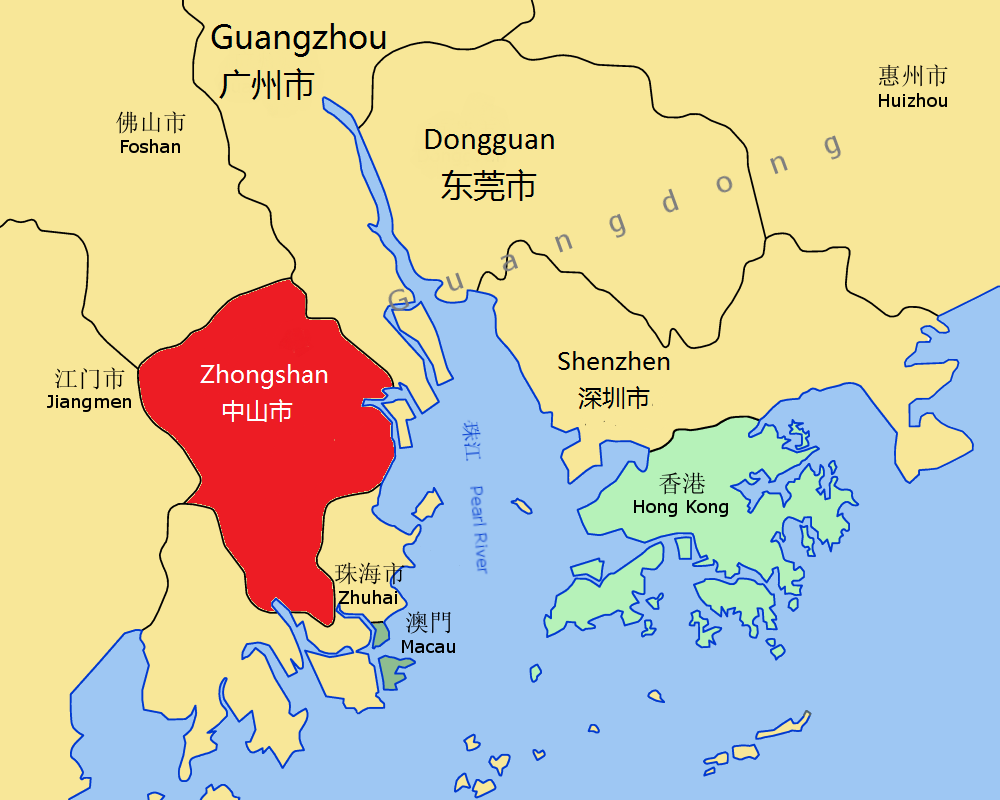
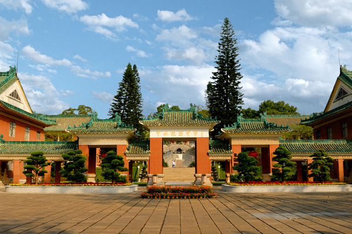

.. _aboutme:

=========
关于我
=========

我出生在孙中山先生的故乡-中国广东中山，家乡对我的人格塑造有很深远的影响，之后会提到。
我小时候不太爱读书，除了小学一年级考过年纪第一，就没有然后了，跌跌撞撞最后居然到了
帝国理工读书，我的求学经历是一个很长的故事。。

我的家乡
=========

我的家乡对我的人格塑造有很深远的影响，一句话概括就是中山精神在我少年时代已经深深植入
我的每一个方面。这听起来有点不可思议，但这却是真实地存在的！

地理
------

我的家乡位于珠三角出海口西面，北靠广州、南靠珠海澳门、西靠江门、东靠深圳香港。

历史概述
------------

前身为1152年设立的香山县；1925年，为纪念孙中山而改名为中山。
明朝，香山北部地区开始淤积成陆，此时才与大陆相连。
中山在古代默默无闻，到近代因为其地理、人文、华侨的原因，与海外交流甚多，成为推翻满清建立
共和的桥头堡。

到2010年，中山市户籍人口只有142.3万，祖籍本市的海外华侨和旅居港澳台同胞共80多万人。
虽然土地和人口很少，但因市民思想开明、民企众多，经济总量排在广东第五位，是中国4个不设市辖区的地级市之一。
除了发展经济，中山人还非常注意环境保护，获得过联合国人居奖。

值得注意的是，珠海和澳门曾经都是中山的一部分，现在也是香山文化的继承者。

石岐话
---------

石岐一直中山最重要的地方，现在是市中心的统称。石岐话是粤语的一种，主要流行于广东省中山市
的石岐及南朗镇、珠海市的唐家湾镇、前山一带，与广州粤语可互通，但又不尽相同。

在民国时期石岐话曾盛极一时，原因是孙中山、唐兆仪等名人都是用石岐话来交流。而且随着由
中山人一手创办的四大百货在上海崛起，许多中山人来到当时十里洋场的上海滩工作，于是石岐话在
当时的上海占有一席之位，其中，四大百货公司中的永安公司名字也是用中山拼音，
读作“Wing On”，甚至在中山人开设的食店，上海人和外国人都会用石岐话来点菜。

香山文化
---------

香山文化在地缘上是指包括今天的中山、珠海、澳门在内的地域文化。它在本质上集中体现了岭南文化中粤、闽、客三大民系的文化特征，是中原文化、土著文化、西洋文化、南洋文化相互碰撞和不断融合的产物

万人行
---------

慈善万人行活动更是中山一道迷人

中山精神对我的影响
----------------------------

20世纪末，中山精神被总结为 “博爱、创新、包容、和谐”，

菊花
------------

学生时代
=============

中山石岐中心小学
------------------

多动症
^^^^^^^^^^^^

学习波动
^^^^^^^^^^^^

三鑫双语学校
----------------

中山纪念中学
----------------

北京理工大学与英国中央兰开夏大学
-------------------------------------

帝国理工
----------------

互联网时代
=============

家里装网啦
-------------

信息来源
------------

不知道从什么时候开始，我的主要信息来源是 `凤凰网 <https://www.ifeng.com>`_ 和 `网易163 <https://www.163.com>`_。

高一
